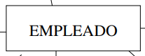
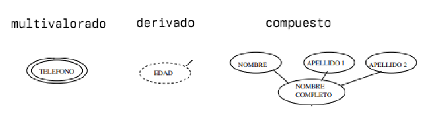
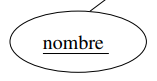
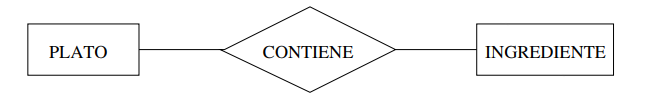
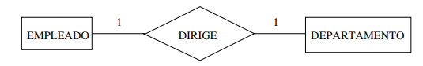
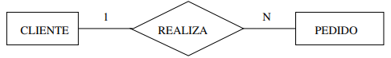
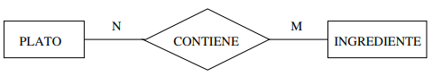
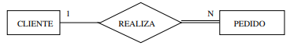
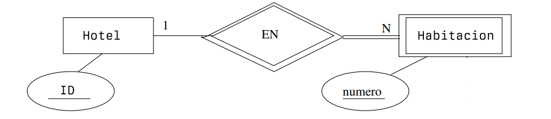
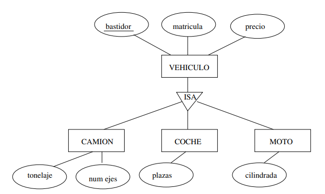

# Modelo Entidad Relación

Es un modelo que nos permite representar la información a nivel conceptual.

## Elementos fundamentales

Hay 3 elementos fundamentales en el Modelo Entidad Relación. Son los siguientes:

- Entidades
- Atributos
- Relaciones

En un modelo que se representa mediante diagramas Entidad-Relación

### Entidades

Las entidades son los elementos básicos del modelo ER y representan una "cosa" del mundo real. Por ejemplo, una persona es una entidad.

Existen entidades débiles, son entidades que no tienen clave primaria en sus atributos. Esto se verá más adelante.

En el diagrama se representan de la siguiente manera:

### Atributos

Los atributos son los componentes más pequeños del modelo ER. Si tomamos el ejemplo de arriba una persona es la entidad y los conjuntos de datos como nombre, dni, fecha de nacimiento, ... son los atributos.

Hay varios tipos de atributos:

- Multivalorados
- Derivados
- Compuestos

Se representan de la siguiente manera en un diagrama del Modelo Entidad Relación:

#### Clave primaria

La clave primaria es importante para el modelo ya que sirve para distinguir una instancia de una entidad de otras instancias de la misma entidad. La clave primaria puede estar compuesta por uno o varios atributos.

Una entidad puede no tener ningún conjunto de atributos que sea clave.

### Relación

Se usan cuando existe una relación entre varias entidades. Siguiendo con el ejemplo de antes, una persona puede estudiar en una facultad, de manera que estas 2 entidades estarían relacionadas entre ellas.

Una relación puede tener atributos pero solo se deben añadir cuando no se puede añadir a ninguna de las 2 entidades.

Las relaciones se pueden establecer entre 2 o más entidades.

También se pueden establecer relaciones recursivas. Pongamos como ejemplo que un empleado es el jefe de otro, podemos hacer que una relación se apunte a sí misma.

#### Restricciones

Las restricciones se utilizan para limitar el número de veces que las entidades pueden/deben participar en el conjunto de relaciones. Existen 2 tipos de restricciones

##### Cardinalidad

Especifica el número **máximo** de relaciones en las que una entidad puede aparecer en el conjunto de relaciones. Las razones de cardinalidad posibles en relaciones binarias entre unidades A y B (A:B) son las siguientes:

- 1:1

- 1:N

- N:N

##### Participación

Indica si cada elemento de un tipo de entidad debe participar obligatoriamente en la relación o no. Por ejemplo si tenemos una base de datos de pedidos realizados por clientes podemos poner la restricción de participación de que todo pedido tiene que estar asociado a un cliente.

### Entidades débiles

Son las entidades que hemos mencionado anteriormente. En sus atributos no contienen una clave primaria. Por ejemplo tenemos una cadena de hoteles y de cada hotel es una entidad de la que se guarda su ID. En la base de datos también tenemos la entidad de la habitación con el atributo de número de habitación.

No se puede identificar la habitación solo por su número ya que puede haber varios hoteles que tengan una habitación 101.

Entonces, para poder identificar una habitación tenemos que usar el número de habitación **y** el id del hotel al que pertenece la habitación.

## Modelo extendido

### Especialización y generalización

Es parecido a la herencia que se observa en la OOP. La especialización parte de un conjunto de entidades inicial (Se empieza con el padre y vamos sacando los hijos), mientras generalización es la metodología inversa.

### Agregaciones

El modelo ER solo permite establecer relaciones entre entidades, no se puede conectar directamente una relación con otra relación.

Esto hace que en caso tengamos que tratar una relación como una entidad de un nivel más alto.

Pongamos como ejemplo lo siguiente(**clave primaria**):

Tenemos las siguientes entidades

Profesor con los atributos **id_profesor**, Nombre y Departamento

Proyecto con los attr **id_proyecto** y título

Organización con los attr **id_org** y nombre

Tiene que haber al menos un profesor que guíe un proyecto. Después tenemos a una organización externa que patrocina tanto al proyecto como al profesor, pero a ninguno por separado.

