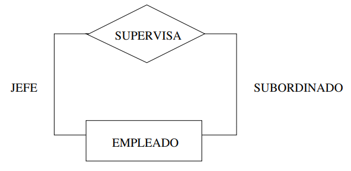

# Modelo Entidad Relacion

Es un modelo que nos permite representar la informacion a nivel conceptual.

## Elementos fundamentales

Hay 3 elementos fundamentales en el Modelo Entidad Relacion. Son los siguientes:

- Entidades
- Atributos
- Relaciones

En un modelo que se representa mediante diagramas Entirad-Relacion

### Entidades

Las entidades son los elementos basicos del modelo ER y representan una "cosa" del mundo real. Por ejemplo, una persona es una entidad.

Existen entidades debiles, son entidades que no tienen clave primaria en sus atributos. Esto se vera mas adelante.

En el diagrama se representan de la siguiente manera:

### Atributos

Los atributos son los componentes mas pequeños del modelo ER. Si tomamos el ejemplo de arriba una persona es la entidad y los conjuntos de datos como nombre, dni, fecha de nacimiento, ... son los atributos.

Hay varios tipos de atributos:

- Multivalorados
- Derivados
- Compuestos

Se representan de la siguiente manera en un diagrama del Modelo Entidad Relacion:

#### Clave primaria

La clave primaria es importante para el modelo ya que sirve para distinguir una instancia de una entidad de otras instancias de la misma entidad. La clave primaria puede estar compuesta por uno o varios atributos.

Una entidad puede no tener un ningun conjunto de atributos que sea clave.

### Relacion

Se usan cuando existe una relacion entre varias entidades. Siguiendo con el ejemplo de antes, una persona puede estudiar en una facultad, de manera que estas 2 entidades estarian relacionadas entre ellas.

Una relacion puede tener atributos pero solo se deben añadir cuando no se puede añadir a ninguna de las 2 entidades.

Las relaciones se pueden establecer entre 2 o mas entidades.

Tambien se pueden establecer relaciones recursivas. Pongamos como ejemplo que un estudiante es el mentor de otro, podemos hacer que una relacion se apunte a si misma.

#### Restricciones

Las restricciones se utilizan para limitar el numero de veces que las entidades pueden/deben participar en el conjunto de relaciones. Existen 2 tipos de restricciones

##### Cardinalidad

Especifica el numero **maximo** de relaciones en las que una entidad puede aparecer en el conjunto de relaciones. Las razones de cardinalidad posibles en relaciones binarias entre unidades A y B (A:B) son las siguientes:

- 1:1

- 1:N

- N:N

##### Participacion

Indica si cada elemento de un tipo de entidad debe participar obligatoriamente en la relacion o no.

### Entidades debiles

Son las entidades que hemos mencionado anteriormente. En sus atributos no contienen una clave primaria. Por ejemplo tenemos una cadena de hoteles y de cada hotel es una entidad de la que se guarda su ID, ubicacion y nombre. En la base de datos tambien tenemos la entidad de la habitacion con el atributo de numero de habitacion.

No se puede identificar la habitacion solo por su numero ya que puede haber varios hoteles que tengan una habitacion 101.

Entonces, para poder identificar una habitacion tenemos que usar el numero de habitacion **y** el id del hotel al que pertenece la habitacion.

## Modelo extendido

### Especializacion y generalizacion

Es parecido a la herencia que se observa en la OOP. La especializacion parte de un conjunto de entidades inicial (Se empieza con el padre y vamos sacando los hijos), minetras generalizacion es la metodologia inversa.

### Agregaciones

El model ER solo permite establecer relaciones entre entidades, no se puede conectar direcamente una relacion con otra relacion.

Esto hace que en caso tengamos que tratar una relacion como una entidad de un nivel mas alto.

Pongamos como ejemplo lo siguiente(**clave primaria**):

Tenemos las siguientes entidades

Profesor con los atributos **id_profesor**, Nombre y Departamento

Proyecto con los attr **id_proyecto** y titulo

Organizacion con los attr **id_org** y nombre

Tiene que haber al menos un profesor que guie un proyecto. Despues tenemos a una organizacion externa que patrocina tanto al proyecto como al profesor, pero a ninguno por separado.

