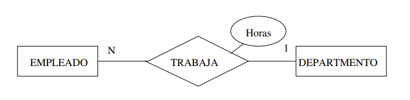
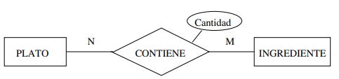

# Modelo Relacional

Establece los principios formales que estan detras de todas las bases de datos relacionales.

Se puede traducir todo modelo ER a RM pero se **pierde alguna informacion**. Por lo general se suele perder cardinalidad y participacion.

Tiene una solida base matematica ya que una BD relacional es una coleccion de relaciones.

Los atributos multivalorados no existen en el modelo relacional

Tomemos como ejemplo esta BD relacional para una empresa con empleados, departamentos y proyectos, en ese orden

| Nif  | Nombre        | IdDept |
|---------|---------------|--------|
| 27347234T | Marta Sánchez | SDP    |
| 85647456W | Alberto San Gil | SDP    |
| 37562365F | María Puente   | RH     |
| 34126455Y | Juan Panero    | SDP    |

| IdDept | Nombre           |
|--------|------------------|
| SDP    | Ventas           |
| RH     | Recursos Humanos |

| CodPrj | Nif_dir | Descr         |
|--------|------------|---------------|
| PR1     | 27347234T | Retail Sales  |
| PR2     | 37562365F | Personnel     |
| PR3     | 37562365F | Logistics     |

Las relaciones son conjuntos de tuplas, **no se permiten tuplas dublicadas**. Cada fila es una tupla y corresponde a un elemento de la relacion.

## Esquema de relacion

Representa la estructura de una relacion del modelo relacional de manera que la relacion Empleados tendria el siguiente esquema.

Empleados(<u>Nif</u>, Nombre, IdDept*)

<u>atributo</u>: El atributo es clave primaria

atributo*: El atributo puede ser nulo

## Claves externas

Se utilizan para reducir redundancia, se usan para relacionar dos relaciones distintas de nuestra base de datos.

Cuando una clave primaria se referencia en otro esquema de relacion tenemos que indicar a que esta referenciando.

Siguiendo con el ejemplo anterior tenemos los siguientes esquemas de relacion.

Empleado(<u>Nif</u>, Nombre, IdDept*)
        Empleados.IdDept -> Departamento.IdDept

Departamento(<u>IdDept</u>, Nombre)

Proyecto(<u>CodPrj</u>, Nif_dir, Descr)
        Proyecto.Nif_dir -> Empleado.Nif

## Conversion del ERM a RM

La conversion sigue una serie de pasos que podemos agrupar por el tipo de elemento a considerar.

### Tipos de entidades

#### Entidades regulares

Cualquier tipo de entidad que no sea debil es una entidad regular.

Entonces lo que hacemos es que para cada entidad regular *E* se crea un esquema de relacion *R* con el mismo numero de atributos.

La clave primaria de *R* es la misma que la de *E*.

#### Entidades debiles

Cada tipo de entidad debil *E* (con entidad identificadora *D*) se transforma en un esqueda de relacion *R* quie inlcuye los attr de *E* mas los atributos de la calde de *D*. La clave primaria de *R* es la combinacion de la clave parcial de *E* con los attr procedentes de la clave primaria de *D*.

### Tipos de relaciones

#### Relacion 1:N

Suponemos que *S* es una relacion 1:N entre dos tipos de entidades *D* y *E*, donde *E* tiene la cardinalidad *N* y ya se han creado los esqumas relacionales *Re* y *Rd*.

Se añaden al esquema *Re*(lado *N* de la relacion) los attr de la clave primaria de *Rd* (lado 1) y los attr de la relacion *S* si existieran. Despues se añade a *Re* una clave externa formada por el conjunto de attr que forma la clave primaria de *Rd*.

Si la participacion de *E* es parcial los attr añadidos a *Re* deben admitir **valores nulos**. Si la participacion de *D*(lado 1) es **total** se **pierde esta informacion**.

De esta manera tenemos que el siguiente diagrama 1:N

Se convierte en los siguientes esquemas de relacion:

Departamento(<u>id_dept</u>, descr)
Empleado(<u>dni</u>, nombre, apellido, fec_nam, id_dept*, horas*)
        Empleado.id_dept -> Departamento.id_dept

Existe la **EXCEPCION** de que si se espera un numero de valores nulos **muy grande** puede ser mejor crear un nuevo esquema de relacion *Rs* con:

- Los attr de las clave primarias de *Re* y *Rd* y los propios de *S*
- Una clave primaria formada por los attr de *Re* (el lado N)
- Claves externas que hacen referencia a *Re* y *Rd*

Entonces el diagrama anterior quedaria de la siguiente manera:

Departamento(<u>id_dept</u>, descr)
Empleado(<u>dni</u>, nombre, apellido, fec_nam)
Trabaja(<u>dni</u>, id_dept, horas)
        Trabaja.dni -> Empleado.dni
        Trabaja.id_dept -> Departamento.id_dept

#### Relacion N:N

Suponemos una relacion *S* de cardinalidad N:N entre dos tipos de entidades *D* y *E* para las que se han creado relaciones *Rd* y *Re* en el modelo relacional.

Se crea un nuevo esquema *Rs* con los attr de las claves primarias de *Rd* y *Re* y los attr de la relacion *S* si los tuviera. La clave primara de *Rs* esta formada por los attr que vienen de las clave primarias de los 2 esquemas *Rd* y *Re*. Se incluyen las dos claves externas en *Rs* de cada uno de los conjuntos de attr que vienen de las claves primarias de *Rd* y *Re*.

La **informacion que se pierda** es la participacion total de ambos tipos de entidad.

Con lo visto anteriormente tendriamos que es siguiente diagrama ER:

Se transformaria en el siguiente esquma relacional:

Plato(<u>id_plato</u>, descr, precio)
Ingrediente(<u>id_ingrediente</u>, descr)
Contiene(<u>id_plato, id_ingrediente</u>, cantidad)
        Contiene.id_plato -> Plato.id_plato
        Contiene.id_ingrediente -> Ingrediente.id_ingrediente

#### Relacion 1:1

Suponemos una relacion 1:1 entre 2 tipos de entidad *E* y *D* para las que sea han creeado esquemas de relacion *Re* y *Rd* en el modelo relacional.

Se pueden dar 3 casos en funcion de las restricciones de participacion.

##### Ambos tienen participacion total en *S*

Se puede crear una unica relacion *Re,d* combinando los attr de ambas entidades. Solo se mantendria una de las claves primarias, solo la que se considere mas adecuada.

Se **pierde** info sobre las restricciones de participacion.

##### Solo uno (*Re*) tiene participacion total en *S*

Se añaden a *Re* los attr de la clave primaria de *Rd* y los attr de S. Se añade una clave primara a *Re* que haga referencia a *Rd*.

Se **pierde** la info de cardinalidad 1 de *Re*

##### Ambos tienen participacion parcial en *S*

Se elige uno de los tipos de entidad y se aplica el caso que solo uno tiene participacion total.

Se **pierde** la info de cardinalidad

### Atributos multivalorados