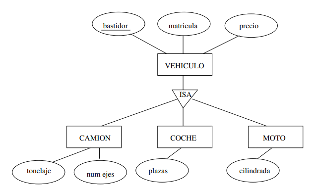

# Modelo Relacional

Establece los principios formales que están detrás de todas las bases de datos relacionales.

Se puede traducir todo modelo ER a RM pero se **pierde alguna información**. Por lo general se suele perder cardinalidad y participación.

Tiene una sólida base matemática ya que una BD relacional es una colección de relaciones.

Los atributos multivalorados no existen en el modelo relacional

Tomemos como ejemplo esta BD relacional para una empresa con empleados, departamentos y proyectos, en ese orden

| Nif        | Nombre          | IdDept |
|------------|-----------------|--------|
| 27347234T  | Marta Sánchez   | SDP    |
| 85647456W  | Alberto San Gil | SDP    |
| 37562365F  | María Puente    | RH     |
| 34126455Y  | Juan Panero     | SDP    |

| IdDept | Nombre           |
|--------|------------------|
| SDP    | Ventas           |
| RH     | Recursos Humanos |

| CodPr | Nif_dir   | Descr         |
|-------|-----------|---------------|
| PR1   | 27347234T | Retail Sales  |
| PR2   | 37562365F | Personnel     |
| PR3   | 37562365F | Logistics     |

Las relaciones son conjuntos de tuplas, **no se permiten tuplas duplicadas**. Cada fila es una tupla y corresponde a un elemento de la relación.

## Esquema de relación

Representa la estructura de una relación del modelo relacional de manera que la relación Empleados tendría el siguiente esquema.

Empleados(<u>Nif</u>, Nombre, IdDept*)

<u>atributo</u>: El atributo es clave primaria

atributo*: El atributo puede ser nulo

## Claves externas

Se utilizan para reducir redundancia, se usan para relacionar dos relaciones distintas de nuestra base de datos.

Cuando una clave primaria se referencia en otro esquema de relación tenemos que indicar a qué está referenciando.

Siguiendo con el ejemplo anterior tenemos los siguientes esquemas de relación.

Empleado(<u>Nif</u>, Nombre, IdDept*)
        Empleados.IdDept -> Departamento.IdDept

Departamento(<u>IdDept</u>, Nombre)

Proyecto(<u>CodPrj</u>, Nif_dir, Descr)
        Proyecto.Nif_dir -> Empleado.Nif

## Conversión del ERM a RM

La conversión sigue una serie de pasos que podemos agrupar por el tipo de elemento a considerar.

### Tipos de entidades

#### Entidades regulares

Cualquier tipo de entidad que no sea débil es una entidad regular.

Entonces lo que hacemos es que para cada entidad regular *E* se crea un esquema de relación *R* con el mismo número de atributos.

La clave primaria de *R* es la misma que la de *E*.

#### Entidades débiles

Cada tipo de entidad débil *E* (con entidad identificadora *D*) se transforma en un esquema de relación *R* que incluye los atributos de *E* más los atributos de la clave de *D*. La clave primaria de *R* es la combinación de la clave parcial de *E* con los atributos procedentes de la clave primaria de *D*.

### Tipos de relaciones

#### Relación 1:N

Suponemos que *S* es una relación 1:N entre dos tipos de entidades *D* y *E*, donde *E* tiene la cardinalidad *N* y ya se han creado los esquemas relacionales *Re* y *Rd*.

Se añaden al esquema *Re* (lado *N* de la relación) los atributos de la clave primaria de *Rd* (lado 1) y los atributos de la relación *S* si existieran. Después se añade a *Re* una clave externa formada por el conjunto de atributos que forma la clave primaria de *Rd*.

Si la participación de *E* es parcial los atributos añadidos a *Re* deben admitir **valores nulos**. Si la participación de *D* (lado 1) es **total** se **pierde esta información**.

De esta manera tenemos que el siguiente diagrama 1:N

Se convierte en los siguientes esquemas de relación:

Departamento(<u>id_dept</u>, descr)
Empleado(<u>dni</u>, nombre, apellido, fec_nam, id_dept*, horas*)
        Empleado.id_dept -> Departamento.id_dept

Existe la **EXCEPCIÓN** de que si se espera un número de valores nulos **muy grande** puede ser mejor crear un nuevo esquema de relación *Rs* con:

- Los atributos de las claves primarias de *Re* y *Rd* y los propios de *S*
- Una clave primaria formada por los atributos de *Re* (el lado N)
- Claves externas que hacen referencia a *Re* y *Rd*

Entonces el diagrama anterior quedaría de la siguiente manera:

Departamento(<u>id_dept</u>, descr)

Empleado(<u>dni</u>, nombre, apellido, fec_nam)

Trabaja(<u>dni</u>, id_dept, horas)
        Trabaja.dni -> Empleado.dni
        Trabaja.id_dept -> Departamento.id_dept

#### Relación N:N

Suponemos una relación *S* de cardinalidad N:N entre dos tipos de entidades *D* y *E* para las que se han creado relaciones *Rd* y *Re* en el modelo relacional.

Se crea un nuevo esquema *Rs* con los atributos de las claves primarias de *Rd* y *Re* y los atributos de la relación *S* si los tuviera. La clave primaria de *Rs* está formada por los atributos que vienen de las claves primarias de los 2 esquemas *Rd* y *Re*. Se incluyen las dos claves externas en *Rs* de cada uno de los conjuntos de atributos que vienen de las claves primarias de *Rd* y *Re*.

La **información que se pierde** es la participación total de ambos tipos de entidad.

Con lo visto anteriormente tendríamos que el siguiente diagrama ER:

Se transformaría en el siguiente esquema relacional:

Plato(<u>id_plato</u>, descr, precio)
Ingrediente(<u>id_ingrediente</u>, descr)
Contiene(<u>id_plato, id_ingrediente</u>, cantidad)
        Contiene.id_plato -> Plato.id_plato
        Contiene.id_ingrediente -> Ingrediente.id_ingrediente

#### Relación 1:1

Suponemos una relación 1:1 entre 2 tipos de entidad *E* y *D* para las que se han creado esquemas de relación *Re* y *Rd* en el modelo relacional.

Se pueden dar 3 casos en función de las restricciones de participación.

##### Ambos tienen participación total en *S*

Se puede crear una única relación *Re,d* combinando los atributos de ambas entidades. Solo se mantendría una de las claves primarias, solo la que se considere más adecuada.

Se **pierde** información sobre las restricciones de participación.

##### Solo uno (*Re*) tiene participación total en *S*

Se añaden a *Re* los atributos de la clave primaria de *Rd* y los atributos de S. Se añade una clave primaria a *Re* que haga referencia a *Rd*.

Se **pierde** la información de cardinalidad 1 de *Re*

##### Ambos tienen participación parcial en *S*

Se elige uno de los tipos de entidad y se aplica el caso que solo uno tiene participación total.

Se **pierde** la información de cardinalidad

### Atributos multivalorados

Por cada atributo multivalorado *M* en un tipo de entidad *E* se crea un nuevo esquema de relación *R* con un atributo *M* más la clave primaria de *E*. Por lo tanto la clave primaria de *R* está formada por el atributo *M* más la clave primaria de *E*

De esta manera si tenemos el siguiente diagrama ER:

Nos quedamos con el siguiente esquema relacional:

Empleado(<u>NSS</u>, nombre, apellido, fec_nam)
Telefono(<u>NSS, telefono</u>)
        Telefono.NSS -> Empleado.NSS

### Relaciones ternarias

Suponemos una relación *S* entre 3 tipos de entidad con a lo sumo una entidad con cardinalidad 1. Se crea un nuevo esquema de la relación *Rs* con los atributos de las claves primarias de los tipos de entidad participantes y los atributos propios de la relación *S*.

La clave primaria de *Rs* está formada por los atributos de las claves primarias de las tres entidades. Si la cardinalidad de un tipo de entidad es 1 entonces la clave primaria de Rs no debe incluir los atributos que proceden de esta entidad.

Por lo tanto la siguiente relación:

Se convierte en el siguiente esquema relacional:

Proveedor(<u>id_prov</u>, nombre)
Ingrediente(<u>id_ingr</u>, descr)
Sucursal(<u>id_suc</u>, dir)
Suministra(<u>id_ingr, id_suc</u>, id_prov)
        Suministra.id_ingr -> Ingrediente.id_ingr
        Suministra.id_suc -> Sucursal.id_suc
        Suministra.id_prov -> Suministra.id_prov

### Generalización y especialización

Suponemos una relación ISA entre un tipo de entidad superclase *P* y un tipo de entidad subclase *S*.

El esquema de relación del tipo de entidad superclase *Rp* se crea como una entidad regular vista más arriba. Para el tipo de entidad subclase *S* se crea un esquema de relación *Rs* que incluye los atributos de *S* y los atributos de la clave primaria de la superclase *Rp*. La clave primaria de este esquema *Rs* está formada por los atributos provenientes de la clave primaria de la superclase *Rp*.

De manera que el siguiente diagrama ER:

Se transforma a los siguientes esquemas relacionales:

Vehículo(<u>bastidor</u>, matrícula, precio)
Camión(<u>bastidor</u>, tonelaje, num_ejes)
        Camión.bastidor -> Vehículo.bastidor
Coche(<u>bastidor</u>, plazas)
        Coche.bastidor -> Vehículo.bastidor
Moto(<u>bastidor</u>, cilindrada)
        Moto.bastidor -> Vehículo.bastidor

### Agregaciones

Suponemos un tipo de relación *S* que relaciona una agregación *A* con un tipo de entidad *E*.

Para pasar la relación *S* al modelo relacional, creamos los esquemas de la misma manera que hemos visto anteriormente pero utilizamos los atributos de la relación S, los atributos de la clave primaria de la entidad *E* y los de la agregación *A*. 

De manera que el siguiente diagrama ER:

Se transforma a los siguientes esquemas relacionales:

Profesor(<u>id_prof</u>, nombre, departamento)
Proyecto(<u>id_proy</u>, tema)
Guía(<u>id_prof, id_proy</u>)
        Guía.id_prof -> Profesor.id_prof
        Guía.id_proy -> Proyecto.id_proy
Organización(<u>id_org</u>, dirección, id_prof, id_proy)
        Organización.{id_prof, id_proy} -> Guía.{id_prof, id_proy}
