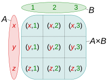

# Data Manipulation Language (DML)

Es el lenguaje que se encarga de manipular los datos y está formado por 4 sentencias:

- `INSERT` para insertar filas en una tabla
- `DELETE` para eliminar filas de una tabla
- `UPDATE` para modificar el contenido de filas en una tabla
- `SELECT` para realizar consultas en tablas

## INSERT

La sentencia inserta una o varias filas nuevas en una tabla:

``` sql
insert into emp values ('12345678Z', 'Paco Paquez', 'IT');
```

Los literales de caracteres deben encerrarse en comillas simples ' '

La sintaxis básica para insertar una fila con datos es la siguiente

``` sql
insert into nombre_tabla [(col1, ..., colk)] values (val1, ..., valk);
```

donde:

- El orden de la lista de nombres de las columnas debe coincidir con el orden de la lista de valores
- Si se omite la lista de columnas se utiliza el orden de la creación de la tabla.

Además, se puede sustituir la cláusula VALUES por una consulta select.

## DELETE

Es una sentencia que elimina filas existentes en una tabla que cumplan una determinada condición

``` sql
delete from distr where horas <= 20;
```

La sintaxis básica para una sentencia delete es la siguiente:

``` sql
delete from nombre_tabla where condición;
```

donde:

- La condición de la cláusula `where` se evalúa para cada fila
- La cláusula `where` es opcional pero si se omite se borran **todas las filas de la tabla**
- La cláusula `where` puede contener condiciones complejas (se verá en detalle en las sentencias `select`)

## UPDATE

Es una sentencia que modifica los valores de las filas existentes en una tabla que cumplan una determinada condición

``` sql
update distr set horas = horas * 1.5 where cod_pr='PR1';
```

La sintaxis básica para una sentencia update es la siguiente:

``` sql
delete from nombre_tabla set col1 = expr1, ..., colk = exprk where condición;
```

donde:

- La condición de la cláusula `where` se evalúa para cada fila. Si es cierta se modifican las columnas especificadas en la cláusula `set`
- La cláusula `where` es opcional pero si se omite se borran **todas las filas de la tabla**
- La cláusula `where` puede contener condiciones complejas (se verá en detalle en las sentencias `select`)

## SELECT

Las consultas de datos se hacen mediante la sentencia `select`

La sintaxis básica es:

``` sql
select expr1, ..., exprN
from tabla1, ..., tablaN
where condición
```

- La cláusula `select` especifica las columnas (o expresiones) que deben aparecer en el resultado
- La cláusula `from` especifica las tablas de las que obtiene la consulta (realiza el producto cartesiano)



-La cláusula `where` es opcional y especifica las condiciones de selección de filas.
        - Si no se incluye se seleccionan todas las filas

Ejemplo con la siguiente tabla distr:

| cod_pr | dni_dir | horas |
|--------|-----|-------|
| PR1 | 12345678Z | 5  |
| PR2 | 12345678Z | 30 |
| PR3 | 87654321Z | 25 |
| PR4 | 87654321Z | 15 |

Si queremos seleccionar los códigos de proyecto del empleado con dni 12345678Z haríamos lo siguiente:

``` sql
select dni 
from distr
where dni = '12345678Z';
```

Y nos devolvería la siguiente tabla:

| dni |
|-----|
| 12345678Z |
| 12345678Z |

Nos devuelve 2 filas porque las consultas SQL trabajan con multiconjuntos en lugar de conjuntos ∴ se pueden repetir valores

Si queremos trabajar con conjuntos (eliminar las tuplas duplicadas) tendríamos que utilizar la cláusula `distinct`

``` sql
select distinct dni_dir 
from distr
where dni_dir = '12345678Z';
```

Para seleccionar todas las columnas de las tablas incluidas en la cláusula `from` se utiliza *

``` sql
select * 
from distr
where horas > 15;
```

| cod_pr | dni_dir | horas |
|--------|-----|-------|
| PR2 | 12345678Z | 30 |
| PR3 | 87654321Z | 25 |

Los atributos de la cláusula `select` pueden ser **expresiones** y se pueden cambiar el nombre de las columnas en el resultado

```sql
select cod_pr "código de proyecto", horas/2
from distr;
```

La evaluación de una sentencia `select` básica se puede ver como una ejecución de los siguientes pasos (no es como lo hace un SGDB pero ayuda a entender el significado)

1. Cálculo del prod. cartesiano de las tablas de la cláusula `from`
2. Eliminación de las filas que no cumplen la condición de la cláusula `where`
3. Eliminación de las columnas que no aparecen en la lista de la cláusula `select`
4. Si se especifica `distinct` eliminación de las filas duplicadas

### Condición de cláusula where

La condición de la cláusula `where` debe ser una expresión lógica formada por:

- `and`, `or`, `not` y una condición booleana simple

donde las condiciones booleanas simples son:

- operadores de comparación: <, > <=, >=, =, !=
- comprobación de valor nulo: expr IS [NOT] NULL
- pertenencia a un conjunto de valores: expr [NOT] IN (v1, ..., vn)
- pertenencia a un rango: expr [NOT] BETWEEN v1 AND v2
- similitud entre cadena de caracteres: expr [NOT] LIKE 'patrón'
        - el carácter _ representa un carácter cualquiera
        - el carácter % representa un carácter cualquiera

si queremos ver que un nombre contenga los caracteres jo:

```sql
select nombre 
from emp
where nombre like %jo%;
```

si queremos el nombre de los empleados que tengan una 'a' en el tercer carácter del nombre:

```sql
select nombre 
from emp
where nombre like %__a%;
```

### Ordenación de los resultados de una consulta

La cláusula `order by` permite establecer el orden de presentación de las filas resultado de una consulta `select`. Se pueden especificar varias columnas e incluso expresiones.

Debe ser la última cláusula de la sentencia `select`.

``` sql
-- Código de proyecto, dni y horas trabajadas de los empleados que trabajan más de 10 horas en algún proyecto ordenado por horas
SELECT CodPr, NIF, horas 
FROM distribución
WHERE horas > 10 
ORDER BY horas;

-- Lo mismo ordenado de manera descendente
SELECT CodPr, NIF, horas 
FROM distribución
WHERE horas > 10 
ORDER BY horas DESC;

-- Ordenado por codPR de forma asc y dentro de cada pr de forma desc
SELECT CodPr, NIF, horas 
FROM distribución
WHERE horas > 10 
ORDER BY CodPR ASC, horas DESC;
```

### Funciones predefinidas

Se pueden utilizar expresiones y funciones en las cláusulas predefinidas en las cláusulas `select` y `where`. Existe un gran número de funciones predefinidas

#### Funciones sobre nulos

`NVL(v, s)`: if *v* is null return s, else return v
`NVL2(v, s1, s2)`: if *v* is null return s2, else return s1

#### Funciones de fecha

`SYSDATE`: obtiene fecha y horas actuales
`ADD_MONTHS(fecha, n)`: añade a fecha el número de meses *n*
`MONTHS_BETWEEN(f1, f2)`: obtiene la diferencia en meses entre 2 fechas
`EXTRACT(v FROM fecha)`: extrae el componente *v* de fecha, *v* puede ser `day`, `month`, `year`, `minute`...

### Conversión de tipos de datos

La que más vamos a usar es la conversión explícita entre texto y fecha:

`TO_DATE(texto[,formato])`
`TO_CHAR(texto[,formato])`

Un ejemplo de uso sería:

``` sql
select to_char(sysdate, 'DD/MONTH/YYYY, DAY HH:MI:SS')
from dual 

-- Seleccionará lo siguiente 05/DICIEMBRE/2024, JUEVES 17:33:04
```

### Consultas con operaciones sobre conjuntos

En SQL se pueden combinar los resultados de distintas sentencias `select` utilizando los operadores de teoría de conjuntos `union`, `intersect`, `minus`.

Hay que tener en cuenta que las columnas devueltas por las 2 consultas deben ser similares: mismo número y tipo.

Estos operadores eliminan las filas duplicadas, pero se pueden mostrar todas las filas de la unión con `union all`

``` sql
-- NIF de los empleados que tienen horas asignadas a los dos proyectos PR1 y PR3 
select nif
from distr
where cod_pr = 'PR1'
intersect
select nif
from distr
where cod_pr = 'PR3'
```

### Consultas sobre varias tablas

En una consulta se pueden combinar varias tablas para formar una consulta más complejas. A estas combinaciones se les llama reuniones (`join`) y se especifican en la cláusula `from`

La condición de la cláusula where puede contener nombres de columnas de cualquiera de las tablas. Si las columnas de 2 tablas tienen el mismo nombre se pueden usar los denominados alias de tabla:

#### Reuniones JOIN (LEFT JOIN / RIGHT JOIN / FULL JOIN)

Vamos a usar las siguientes tablas como ejemplo:

##### dpto

| cod_dp | nombre      |
|--------|-------------|
| D01    | HR          |
| D02    | IT          |
| D03    | Sales       |
| D04    | Marketing   |

##### emp

| dni        | nombre               | cod_dp |
|------------|----------------------|--------|
| 1234567890 | John Doe             | D01    |
| 0987654321 | Jane Smith           | D02    |
| 1122334455 | Emily Johnson        | D03    |
| 2233445566 | Michael Brown        | D01    |
| 3344556677 | Sarah Davis          | NULL   |

##### proyecto

| cod_pr | dni_dir    | descr           |
|--------|------------|-----------------|
| P01    | 1234567890 | Project Alpha   |
| P02    | 0987654321 | Project Beta    |
| P03    | 1122334455 | Project Gamma   |

##### distr

| cod_pr | dni        | horas |
|--------|------------|-------|
| P01    | 1234567890 | 10    |
| P01    | 2233445566 | 20    |
| P02    | 0987654321 | 15    |
| P03    | 1122334455 | 25    |
| P03    | 3344556677 | 30    |

El **JOIN** une las tablas donde los índices aparecen en ambas, es decir si hacemos lo siguiente:

``` sql
select e.nombre nombre_emp, d.nombre_dpto 
from emp e join on dpto d e.cod_dp = d.cod_dp;
```

Obtendríamos una tabla como la siguiente. Véase que Sarah Davis no aparece ya que no tiene un cod_pr asociado.

| nombre_emp    | nombre_dpto |
|---------------|-------------|
| John Doe      | HR          |
| Michael Brown | HR          |
| Jane Smith    | IT          |
| Emily Johnson | Sales       |

El **LEFT JOIN** une las tablas de manera que obtiene todas las filas de la primera tabla y las combina con los resultados de la segunda o rellena con valores nulos por correspondencia de manera que:

``` sql
select e.nombre nombre_emp, d.nombre_dpto 
from emp e left join on dpto d e.cod_dp = d.cod_dp;
```

daría como resultado la siguiente tabla

| Employee Name | Department Name |
|---------------|-----------------|
| John Doe      | HR              |
| Michael Brown | HR              |
| Jane Smith    | IT              |
| Emily Johnson | Sales           |
| Sarah Davis   | NULL            |

El **RIGHT JOIN** une las tablas de manera que obtiene todas las filas de la segunda tabla y las combina con los resultado de la primera o rellena con valores nulos por correspondencia de manera que:

``` sql
select e.nombre nombre_emp, d.nombre_dpto 
from emp e right join on dpto d e.cod_dp = d.cod_dp;
```

daría como resultado:

| Employee_Name | Department_Name |
|---------------|-----------------|
| John Doe      | HR              |
| Michael Brown | HR              |
| Jane Smith    | IT              |
| Emily Johnson | Sales           |
| NULL          | Marketing       |

EL **FULL JOIN** une las tablas de manera que obtiene todas las filas de ambas tablas y las combina o rellena con valores nulos por correspondencia de manera que:

``` sql
select e.nombre nombre_emp, d.nombre_dpto 
from emp e full join on dpto d e.cod_dp = d.cod_dp;
```

obtiene la tabla:

| Employee_Name | Department_Name |
|---------------|-----------------|
| John Doe      | HR              |
| Michael Brown | HR              |
| Jane Smith    | IT              |
| Emily Johnson | Sales           |
| Sarah Davis   | NULL            |
| NULL          | Marketing       |

### Funciones de agregación

En sql también se pueden realizar consultas en las que se agrupan las filas resultado. Permiten calcular resultados sobre grupos de filas de una consulta `select`.

``` sql
-- devuelve el número de filas resultado de la consulta
COUNT(*) 

-- Devuelve el número de valores [distintos] de la columna col (o expresión expr). No incluye las filas con valor NULL
COUNT([DISTINCT]col|expr)

-- Devuelve la suma de todos los valores [distintos] de la columna col(numerica) (o expresión expr).
SUM([DISTINCT]col|expr)
-- Devuelve el valor medio de todos los valores [distintos] de la columna col(numerica) (o expresión expr).
AVG([DISTINCT]col|expr)

-- Devuelve el valor máximo de la columna o expresión o el MIN
MAX(col|expr)
```

### Agrupaciones

Las funciones de agregación consideran las filas de una consulta como un grupo sobre el que se calcula una sola fila resultado. Esta idea se puede extender a múltiples grupos

``` sql
select [distinct] lista_expr 
from tablas
where condición_where
group by cols_group
having condición_group
[order by orden]
```

La sentencia `group by` produce tantas filas como valores diferentes de cols_group. Si se omite el group by toda la tabla es un único grupo.

La cláusula `having` selecciona que grupos aparecen en el resultado. En las cláusulas de `select` y `having` solo pueden aparecer expresiones disponibles para las filas de grupo:

- Nombres de columnas: solo aquellas que también aparezcan en la cláusula `group by`
- Funciones de agregación

Un ejemplo simple de lo mencionado arriba sería el siguiente:

Imaginemos que tenemos una tabla de ventas con los siguientes datos:

| CountryCode | Country | Amount |
|---------|---------|--------|
| A       | USA     | 100    |
| B       | USA     | 150    |
| A       | Canada  | 200    |
| B       | Canada  | 50     |
| C       | USA     | 300    |
| D       | Canada  | 400    |
| A       | Mexico  | 500    |
| B       | Mexico  | 100    |
| C       | Canada  | 150    |
| D       | USA     | 100    |
| A       | Canada  | 250    |
| B       | USA     | 200    |

``` sql
SELECT Country, SUM(Amount) TotalSales
FROM Sales
GROUP BY Country;
```

| Country | TotalSales |
|---------|------------|
| USA     | 850        |
| Canada  | 850        |
| Mexico  | 600        |

Un ejemplo más complicado podría ser el siguiente

| OrderID | CustomerID | OrderDate  | Amount | ProductCategory |
|---------|------------|------------|--------|-----------------|
| 1       | 101        | 2024-01-01 | 500    | Electronics     |
| 2       | 102        | 2024-01-02 | 700    | Furniture       |
| 3       | 101        | 2024-01-03 | 200    | Electronics     |
| 4       | 103        | 2024-01-04 | 800    | Electronics     |
| 5       | 104        | 2024-01-05 | 300    | Furniture       |
| 6       | 102        | 2024-01-06 | 400    | Electronics     |
| 7       | 101        | 2024-01-07 | 600    | Furniture       |
| 8       | 103        | 2024-01-08 | 900    | Furniture       |
| 9       | 104        | 2024-01-09 | 500    | Electronics     |
| 10      | 105        | 2024-01-10 | 1000   | Furniture       |

To find the total and average amount spent by each customer on each product category, but only include customers who have spent more than $1000 in total, you can use the following SQL query:

Imaginamos que queremos encontrar el total y la media gastada por cada cliente en cada categoría, pero solo queremos incluir aquellos que se han gastado más de 600 en total.

```sql
SELECT CustomerID, ProductCategory, SUM(Amount) as TotalSpent, AVG(Amount) as AvgSpent
FROM Orders
GROUP BY CustomerID, ProductCategory
HAVING SUM(Amount) > 600;
```

| CustomerID | ProductCategory | TotalSpent | AvgSpent |
|------------|-----------------|------------|----------|
| 101        | Electronics     | 700        | 350      |
| 102        | Furniture       | 700        | 700      |
| 103        | Electronics     | 800        | 800      |
| 103        | Furniture       | 900        | 900      |
| 105        | Furniture       | 1000       | 1000     |

### Consultas anidadas

Es posible utilizar una consulta dentro de otra consulta.

Se pueden incluir subconsultas en las cláusulas `where` pero también pueden estar en las cláusulas `from` y `having`.

Normalmente se utiliza para comprobar la pertenencia a una (multi)conjunto, su cardinalidad o hacer comparaciones:

``` sql
-- Empleados con sueldo por debajo del sueldo medio
select nombre, salario
from emp
where salario < (select avg(salario) from emp);
```

∃ operadores específicos de subconsultas que permiten comprobar la pertenencia a un conjunto y resultado (no) vacío de una consulta

- `expr [NOT] IN (subconsulta)`: comprueba la pertenencia o no de expr al multiconjunto resultante de una subconsulta
- `[NOT] EXISTS (subconsulta)`: comprueba si la consulta devuelve algún resultado (o no) (devuelve true, o false)

``` sql
-- Empleados que son directores de proyectos
select *
from emp
where dni IN 
(select dni_dir from proyecto);
```

#### Consultas anidadas correlacionadas

Ocurre cuando una subconsulta depende de la fila de la consulta externa. Son muy comunes cuando se utiliza el operador exists

``` sql
-- Directores de proyecto asignados al proyecto al que dirigen
select dni_dir
from proyecto p
where cod_pr in 
(select cod_pr 
from distr d 
where d.dni = p.dni_dir);
```

Se pueden usar subconsultas en `from` como si fueran tablas

``` sql
/* 
Para cada empleado asignado a proyectos, obtener la diferencia entre el 
total de horas asignadas al empleado y el promedio global de horas por
empleado 
 */
select nif, e.horas_emp - a.horas_avg
from ( 
        select dni, sum(horas) horas_emp
        from distribución
        group by nif
) e, 
(
        select avg(sum(horas)) horas_avg
        from distr
        group by nif
) a
```
