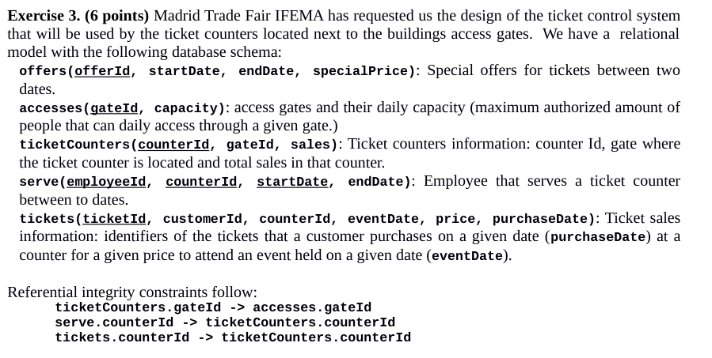

# Examen enero 2019

## Ejercicio 1

## Ejercicio 2

## Ejercicio 3



a.

``` sql
/*
  Write a SQL query that shows the customers identifiers that we expect that will access
  through gate ‘North’ on january 20th, 2019, together with the name of the employees that sold them their tickets. Sort the results by the customer Id and then by employee Id, both in ascending order.
*/
select t.customerId, s.employeeId
from tickets t
join serve s on t.counterId = s.counterId
join ticketCounters tc on s.counterId = tc.counterId
where t.eventDate = to_date('19.01.2019') and tc.gateId = 'North'
order by t.customerId, s.employeeId asc;
```

b.

``` sql
/* 
  Write a SQL query that shows the gates and the dates when the number of tickets sold in that gate exceeded the capacity of the gate
*/
select a.gateId, t.eventDate
from accesses a 
join ticketCounters tc on a.gateId = tc.gateId
join ticlets t on tc.counterId = t.counterId
group by a.gateId, t.eventDate, a.capacity
having count(*) > a.capacity;
```

c.

``` sql
/* 
  Write a SQL query that shows the ticket counters that were not served by any employee on
  december 28th, 2018
*/
```

d.

``` sql
/*
  Write a SQL query that shows the ticket counter (or counters) that has sold the largest
  amount of tickets in 2018, and the number of tickets sold.
*/
```

e.

``` sql
/*
  Write a SQL query that shows, for all gates, the number of ticket counters that have not
  sold any ticket (sales = 0).  If there is a gate in which all ticket counters have sold 
  something, the query must show the gate identifier and a 0
*/
```

f.

``` sql
/* 
  Write a PLSQL stored procedure that receives a gate identifier as a parameter.   For each
  ticket counter of this gate it must show on the console the customer identifier of all
  customers that have purchased tickets on that counter, the number of tickets purchased by each
  customer and the amount spent by each customer on tickets. It must then show the total number 
  of tickets and total sales for that counter, and update the column sales of the ticketCounters 
  table with that total. The procedure must use exceptions to control that there are no tickets sold for the gate and that the gate does not exist in the database (two different messages). 

  An example the execution of this procedure follows:
  Ticket counter: North 01 
    Cust.Id: 12345678A, Amount: 30, Tickets: 3
    Cust.Id: 23456789B, Amount: 10, Tickets: 1
    Total: 4 tickets (40 €)
  Ticket counter: North 02 
    Cust.Id: 23456789B, Amount: 18, Tickets: 2
    Total: 2 tickets (18 €)
  Ticket counter: North 03 
    Cust.Id: 34567890C, Amount: 9.5, Tickets: 1
    Total: 1 tickets (9.5 €)
*/
```

g.

``` sql
/* 
Write a trigger that automatically sets the sale date and the price of a new ticket sold (when a
row is inserted). The sale date must be set the current date. If there exists  an offer 
applicable to the current date, the price must be set to its special price. If there is no offer 
applicable, a normal fare of 12 euros will be applied. The trigger must also update the column
sales of the table ticketCounters whenever a ticket is purchased or returned (deleted from table tickets).
If a ticket is purchased for a past event, the trigger must raise a PROGRAM_ERROR pre-defined exception.
*/
```
