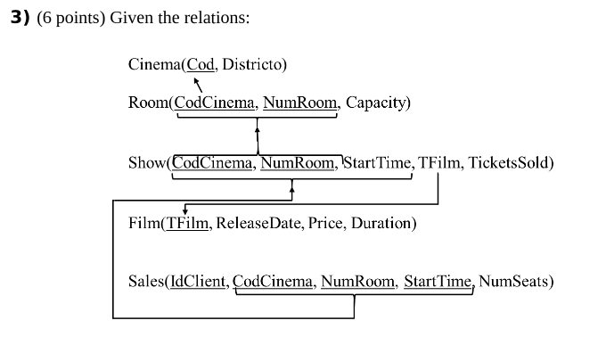

# Examen febrero 2017

## Ejercicio 1

## Ejercicio 2

## Ejercicio 3



a.

``` sql
/*
  Show the title of the films which duration is greater than 90 minutes and at
  least one cinema at district 24321 shows them.
*/
select distinct f.TFilm title
from Film f
join Show s on f.TFilm = s.TFilm
join Cinema c on s.CodCinema = c.Cod
where f.Duration > 90 and c.District = 24321;
```

b.

``` sql
/* 
  Show the title of the films which duration is greater than 90 minutes and at
  least there exists a district such that the total number of the seats of the cinemas (in the
  district) that show the film is greater than 300.
*/
select f.TFilm title
from Film f
join Show s on f.TFilm = s.TFilm
join Room r on s.CodCinema = r.CodCinema and s.NumRoom = r.NumRoom
join Cinema c on r.CodCinema = c.Cod
where duration > 90
group by f.TFilm, c.district
having sum(r.Capacity) > 300;
```

c.

``` sql
/* 
  Show the codes of the cinemas together with the number of rooms of each of
  them for which none ticket have been sold. If for all the rooms in a cinema at least one
  ticket has been sold you must show 0.
*/
select distinct c.cod, nvl(num_shows, 0)
from Cinema c
left join (
  select s.CodCinema, count(*) num_shows
  from Show s
  where s.TicketsSold = 0
  group by s.CodCinema
) on c.Cod = s.CodCinema;
```

d.

``` sql
/*
  Show the codes of the cinemas that only show films whose release date was
  during 2016.
*/
select c.Cod
from Cinema c
where c.cod not in (
  select f.TFilm, s.CodCinema
  from Film f
  join Show s on f.TFilm = s.TFilm
  where extract(year from f.ReleaseDate) != 2016
) and extract(year from f.ReleaseDate) = 2016;
```

e.

``` sql
/*
  Show the districts in which the highest number of distinct films has been
  showed.
*/
select c.District, count(distinct s.TFilm) num_films
from Cinema c
join Show s on c.Cod = s.CodCinema
group by c.District
having num_films = (
  select max(count(distinct s.TFilm))
  from Cinema c
  join Show s on c.Cod = s.CodCinema
  group by c.District
);
```

f.

``` sql
/* 
  Write a stored procedure with a cinema as input parameter. The procedure must
  show the data associated to the cinema: code, the total number of rooms and the total capacity
  of the cinema. Next, the procedure will show information associated to the shows in the
  different rooms ordered by the stating time: starting time, room, title of the film and number of available seats. 
*/
create or replace procedure info_cine(p_cod IN Cinema.Cod%type) is
  v_cinema_data varchar2(300);
  cursor cur_show is
    select s.StartTime, s.NumRoom, s.TFilm, r.Capacity - s.TicketsSold available
    from show s
    join room r on s.CodCinema = r.CodCinema and s.NumRoom = r.NumRoom
    where s.CodCinema = p_cod
    order by s.StartTime;
begin
  select "Code: " || p_cod || ", Number of rooms: " || count(*) || " , total capacity: " sum(capacity) 
  into v_cinema_data
  from Room
  where CodCinema = p_cod;

  dbms_output.put_line('-----------');
  for rec_show in cur_show loop
    dbms_output.put_line(to_char(rec_show.StartTime) || ' ' || to_char(rec_show.NumRoom) || ' ' || rec_show.TFilm || ' ' || to_char(rec_show.available));
  end loop;
  dbms_output.put_line('-----------');
end;
/
```

g.

``` sql
/* 
  Write a trigger that updates the column TicketsSold in the table Show when a ticker is sold, cancelled, or the number of seats in the table Sales is modified.
*/
create or replace trigger TicketsSold
after insert or delete or update on Sales
for each row
  if deleting then
    update Show
    set TicketsSold = TicketsSold - :old.TicketsSold
    where
      CodCinema = :old.CodCinema and
      NumRoom = :old.NumRoom and
      StartTime = :old.StartTime;
  elsif inserting then
    update Show
    set TicketsSold = TicketsSold + :new.TicketsSold
    where 
      CodCinema = :old.CodCinema and
      NumRoom = :old.NumRoom and
      StartTime = :old.StartTime;
  else 
    update Show
    set TicketsSold = TicketsSold - :old.TicketsSold
    where
      CodCinema = :old.CodCinema and
      NumRoom = :old.NumRoom and
      StartTime = :old.StartTime;
    update Show
    set TicketsSold = TicketsSold + :new.TicketsSold
    where 
      CodCinema = :old.CodCinema and
      NumRoom = :old.NumRoom and
      StartTime = :old.StartTime;
  end if;
end;
```
